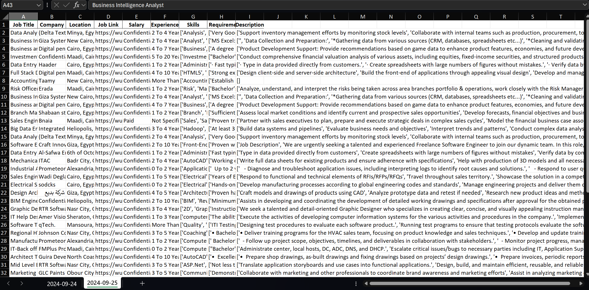

# Wuzzef Daily Data scraper

- [Introduction](#introduction)
- [Requirments](#requirments)
- [Technologies and libraries](#technologies-and-libraries)
- [Code Snips](#code-snips)
- [Bash Code](#bash-code)
- [Result](#result)
- [Further work](#further-work)

* * *

## Introduction

Imagine running a one file gets you all the jobs for the desired position fetched from [wuzzef](/C:/Users/Mohamad%20Hosam/AppData/Local/Programs/Joplin/resources/app.asar/wuzzef.net "wuzzef.net") on today this projects aims to do this so easily as Imagined.

## Requirments

`pip install selenium datetime argparse warnings openpyxl`

## Technologies and libraries

- Python
- Selenium
- Visual studio
- Pandas
- Excel
- Power shell

## Code snips

### Connector

Opens google chrome driver and type desired position and search for it

```py
driver = webdriver.Chrome()

driver.get("https://wuzzuf.net")
search_input = driver.find_element(By.CLASS_NAME,'css-ukkbbr.e1n2h7jb1')

# Clear the search input if necessary and enter the job title (e.g., 'Data Analyst')
search_input.clear()
search_input.send_keys(position)
```

### Min and max years of experience

Sets the min and max years of the experience after searching for position

```py
experience_section = driver.find_element(By.XPATH, "//h3[contains(., 'Years of experience')]")
experience_section.click()

time.sleep(1)

# Wait for the "Min" input field to appear
wait = WebDriverWait(driver, 10)

# Locate the 'Min' field using the class 'css-1ph4zhu-placeholder'
min_input = wait.until(EC.presence_of_element_located((By.XPATH, "//div[contains(@class,'css-1ph4zhu-placeholder') and text()='Min']/following::input[1]")))
min_input.click()
min_input.clear()
min_input.send_keys("0")
min_input.send_keys(Keys.ENTER)


# Wait for the results page to load
time.sleep(3)


# Step 3: Wait for and select the 'Max' input field
max_input = wait.until(EC.presence_of_element_located((By.XPATH, "//div[contains(@class,'css-1ph4zhu-placeholder') and text()='Max']/following::input[1]")))
max_input.click()
max_input.clear()
max_input.send_keys("5")
max_input.send_keys(Keys.ENTER)

print(f"Successfully selected the Years of experience Filter.")
```

### Time of posting

This filters the time of posting the job.

```py
try:
# Step 1: Open the "Date Posted" section (if not already opened)
date_posted_section = driver.find_element(By.XPATH, "//h3[contains(., 'Date Posted')]")

date_posted_section.click()

driver.execute_script("arguments[0].scrollIntoView(true);", date_posted_section)


# Wait for the "Min" input field to appear
wait = WebDriverWait(driver, 10)

# Step 3: Find the radio button using the provided text (e.g., 'Past week')
option_xpath = f"//span[text()='{option_text}']/preceding::input[1]"
desired_option = wait.until(EC.presence_of_element_located((By.XPATH, option_xpath)))

# Step 4: Use JavaScript to click the radio option
driver.execute_script("arguments[0].click();", desired_option)

print(f"Successfully selected the '{option_text}' option.")

except Exception as e:
print(f"An error occurred: {str(e)}")
```

### Extract job data

extract all the job details after opening the job page then adds this details to a list of dictionaries of data scrapped

```py
for job_card in job_cards:
try:
    # Find the job title link and its URL
    job_title_link = job_card.find_element(By.CSS_SELECTOR, "a.css-o171kl")
    job_url = job_title_link.get_attribute("href")

    # Open the job URL in a new tab
    driver.execute_script(f"window.open('{job_url}', '_blank');")

    # Switch to the new tab where job details are displayed
    driver.switch_to.window(driver.window_handles[-1])
    # Optional: Add a delay to allow the page to load the job details
    time.sleep(2)

    # Step 3: Extract job details (adjust the CSS selectors as per the page's structure)
    job_title = driver.find_element(By.CSS_SELECTOR, 'h1.css-f9uh36').text.strip()
    # Extract company name and location using JavaScript
    company_name = driver.execute_script("return document.querySelector('strong.css-9geu3q').textContent").split('\xa0')[-2][:-2]
    location = driver.execute_script("return document.querySelector('strong.css-9geu3q').textContent").split('\xa0')[-1]
    # Extract experience, salary, skills, description, and job requirements
    experience = driver.find_element(By.CSS_SELECTOR, 'span.css-4xky9y').text.strip()
    salary = driver.find_element(By.XPATH, "//div[contains(@class, 'css-rcl8e5')]//span[contains(text(), 'Salary')]/following-sibling::span").text
    skills = driver.find_element(By.CSS_SELECTOR, 'div.css-s2o0yh').text.split()[3:]
    job_description = driver.find_element(By.CSS_SELECTOR, 'div.css-1uobp1k').text.split('\n')[1:]
    try :
        job_requirements = driver.find_element(By.CSS_SELECTOR, 'div.css-1t5f0fr').text.split('\n')[1:]
    except Exception as e:
        job_requirements = None
    # Append the extracted details to the job_data list
    job_data.append({
        "Job Title": job_title,
        "Company": company_name,
        "Location": location,
        "Job Link": job_url,
        "Salary": salary,
        "Experience": experience,
        "Skills": skills,
        "Job Requirements": job_requirements,
        "Description": job_description
    })

    # Close the job details tab
    driver.close()

    # Step 4: Switch back to the original tab to continue extracting the next job
    driver.switch_to.window(driver.window_handles[0])
except Exception as e:
    # If any error occurs, print it for debugging
    print(f"Failed to extract details for job: {e}")
```

### Navigate through pages

This code goes for every found page one by one and scrap all the jobs there

```py
page_index = 1  # Start with the first page

while True:
    print(f"Processing page {page_index}...")  # Log the current page

    # Step 1: Extract job details from the current page
    extract_job_details(driver, job_data)

    try:
        next_button = driver.find_element(By.XPATH, f"//button[contains(@class,'css-zye1os') and .//a[contains(@href,'start={page_index}')]]")
        next_button.click()

        # Optional: Add a delay to allow the next page to load
        time.sleep(3)

        # Step 4: Ensure the page has actually advanced (log the current URL to verify)
        current_url = driver.current_url
        print(f"Successfully moved to page {page_index + 1}. URL: {current_url}")

        # Increment the page index
        page_index += 1

    except Exception as e:
        # If the "Next" button is not found, we are on the last page
        print("No more pages to navigate. Scraping complete.")
        break  # Exit the loop when there are no more pages

```

## Bash code

This code is added and changed the file type to bat to run automatically on click

```py
@echo off

:: Default value for time argument
set time_arg=Past 24 hours
if not "%1"=="" set time_arg=%1

:: Loop through the three positions
for %%P in ("Data Analyst" "Business Intelligence" "Data Engineer") do (
    echo Running script for "%%P" with time argument "%time_arg%"
    py scrap_wuzzef.py --position=%%P --time="%time_arg%"
)

```

## Result

This saves the result in a Excel file with sheet name current day.


## Further work

You can put the bat file in the task scheduler so it runs daily and fetch new data this is all like batch processing.